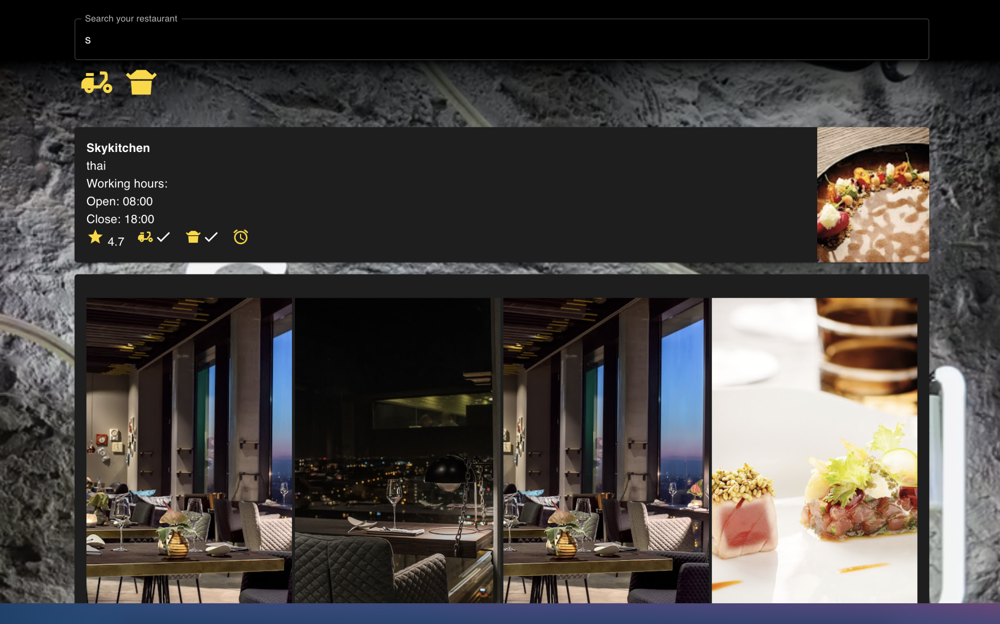

## restaurant finder

We created this onlineShopping as a final project of JavaScript Course by [ReDI School](https://www.redi-school.org/)

### Overview

Users should be able to:

- Search filter for restaurants in berlin 
- Filter icons for delivery and pickup
- Information about the restaurant's working hours, rating, availability for delivery or pickup, and photos of the meals.

### Built with
- Api:https://redi-final-restaurants.herokuapp.com/restaurants
- React
- For UI was used material https://mui.com/

### Authors

https://github.com/arianecrestani
https://github.com/sipter

